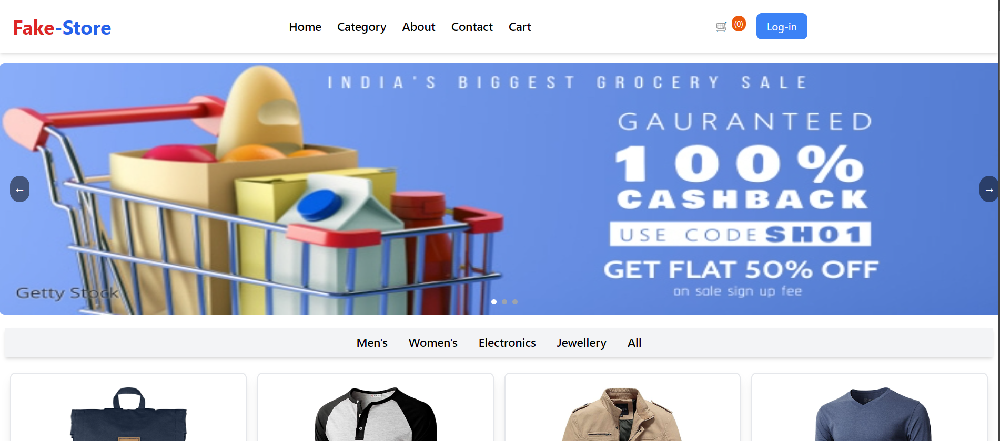

# E-Commerce React App



A responsive E-Commerce web application built with React, showcasing a variety of products and offering features like product filters, a shopping cart, and much more.

## 🚀 Live Demo

Check out the live demo of the project: [Live Demo](https://fake-store-in.netlify.app/)

## 🛠️ Features

- Browse products by categories
- Add/remove items to/from the cart
- Responsive design for all device sizes
- API integration to fetch product data

## 🖥️ Technologies Used

- React
- Tailwind CSS
- API integration
- Fake-Store

## 📚 Installation Guide

To get a local copy of the project and run it on your machine, follow these steps:

### 1. Clone the Repository

```
git clone https://github.com/your-username/your-repo-name.git

```
### 2. Navigate to the Project Directory

```
cd your-repo-name

```
### 3. Install Dependencies

Make sure you have Node.js and npm installed. Then, install the dependencies:
```
npm install
```
### 4. Start the Development Server
```
npm start
```
This will start the app in development mode. Open http://localhost:3000 to view it in the browser.

### 5. Build the Project (for Production)

If you want to build the project for production:
```
npm run build
```
This will optimize and bundle your React app for deployment.

--Sanjeevkumar 💖
